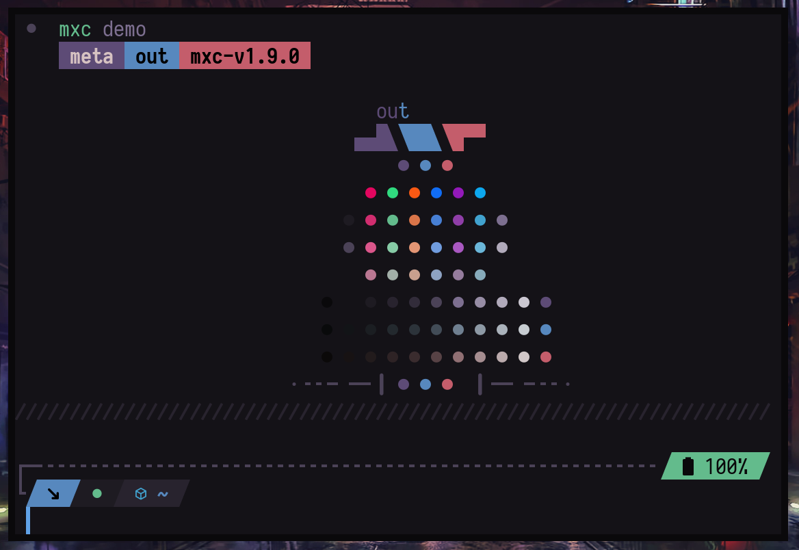
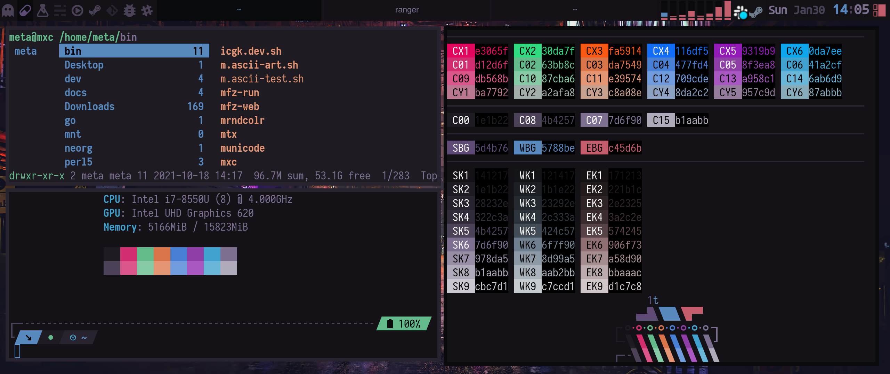

# kitty-mxc
<p align="center">
  
</p>

dark kitty theme, with random colors from [mxcolr](https://github.com/metaory/mxcolr) project

<p align="center">
  
</p>
<p align="center">
  
</p>


Usage
=====

```
cp kitty-theme.conf ~/.config/kitty/
echo "include kitty-theme.conf" >> ~/.config/kitty/kitty.conf
```
## The theme file `kitty-theme.conf` is generated by [mxcolr](https://github.com/metaory/mxcolr)

TODO: write readme

